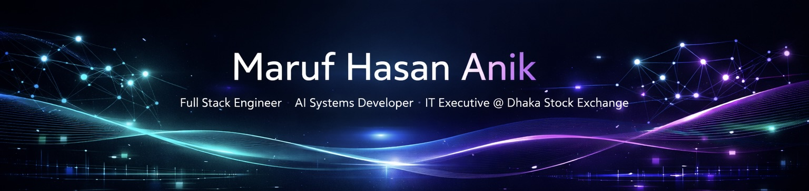

  

---

## Impact

- 🧠 AI Model Accuracy: **99%**
- 🏢 Enterprise Test Cases: **350+**
- ⚙️ Projects Delivered: **15+**
- 💻 DSA Problems: **200+**
- 🎓 CGPA: **3.74 / 4.00**

---

## Featured Work

**CCTV AI Guardian**  
Real-time violence detection system (YOLOv8 + CNN-LSTM)

**ARK PlayZone**  
Full-stack multi-platform system (Next.js + NestJS + Kotlin)

**Enterprise Backend API**  
.NET + Oracle + Clean Architecture system

---

## Tech Stack

Java • Python • TypeScript • C++  
React • Next.js • Vue  
Spring Boot • NestJS • .NET  
Oracle • PostgreSQL • MySQL  
TensorFlow • PyTorch • OpenCV  

---

## Experience

**IT Executive — Dhaka Stock Exchange PLC**  
Enterprise systems • testing • Oracle • Java backend

**BNCC (6 years)**  
Cadet Under Officer • leadership • discipline

---

## Connect

LinkedIn: https://linkedin.com/in/skipperanik  
Email: hasanmaruf0055@gmail.com  

---

  Bangladesh Standard Time (UTC+6)

  

